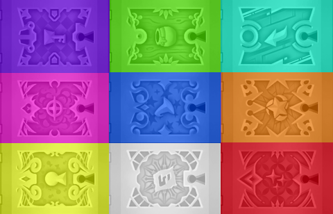

# Chest Visuals (High Contrast)

Makes chest visuals more distinguishable when using the Chest Visuals Match Contents option in a KH2 Randomizer seed.

Place this mod _above_ the randomizer seed in OpenKH Mods Manager so that its visuals take priority over the ones from
the randomizer seed.

Original chest visual images by [Televo](https://github.com/Televo/) and [Dee-Ayy](https://github.com/Dee-Ayy).

# Changelog

## 2.0.0

- Add a high contrast version of the new equipment chest planned for 3.1 of the seed generator
- Add large symbols to the chests to further aid in distinguishing
- Readjust some colors to accommodate the equipment chest
- Ensure the "junk" chests use their normal model size for visibility, rather than the smaller chest
  model which is harder to see from afar

## 1.0.2

- Make the colors slightly brighter to help be more visible in darker areas such as the Underworld
- Add slightly more contrast between the magic/weapon chest colors and the ability/form chest colors

## 1.0.1

- Add even more contrast

## 1.0.0

- Initial public release
